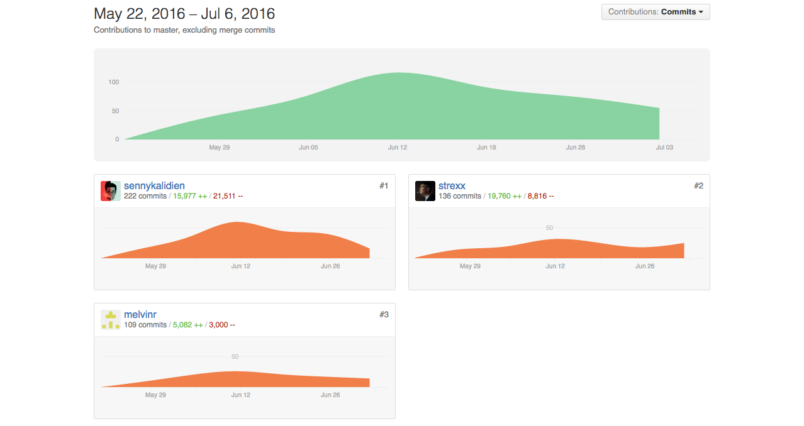

# Contributions to the Ultimate Frisbee App (UFA)
This is the individual README of Senny Kalidien, made for the Amsterdam University of Applied Sciences, at the study of  Communication and Multimedia Design.

In this README you can see read about my experience with this project, my activities on a weekly basis and the contributions that have been made to the [main repository](https://github.com/strexx/Ultimate-Frisbee-App).

**The other readme's**

- [Go to the main README of the repository](https://github.com/strexx/Ultimate-Frisbee-App)
- [Go to the individual README of contributor Fons Hettema](https://github.com/strexx/Ultimate-Frisbee-App/blob/master/README_fons.md)
- [Go to the individual README of contributor Melvin Reijnoudt](https://github.com/melvinr/Ultimate-Frisbee-App)

## Table of content
1. [The contribution](The contribution)
  1. [My experience](my-experience-during-this-project)
  2. [Activities per week](#activities-per-week)
  4. [Contributions to the repository](#contributions-to-the-repository)
  5. [Code highlights](#code-highlights)
2. [How the app works](#how-the-app-works)


## The contribution

## My experience
This project was a great way to measure my current skills as a front-end developer. After following some very intensive courses during this study, I wasn't sure how I would stand as a front-end developer now. Was I ready to finally be a worthy developer and be part or even contribute to this big community? Can I develop good and user friendly products? These were questions that needed to be answered before I finished my study.

I've collaborated daily with the other two contributors of the respository: Melvin Reijnoudt & Fons Hettema. It was a interesting journey and fun experience to collaborate with a big project like this one with a life span of 7 weeks. The most interesting thing was finding out how to collaborate effectively when we would create this app together. Github is obviously a great tool for this purpose. But with Github alone you won't make it. In the beginning we would always meet and sit together to work on the app. Because we are all three very easy distracted, we needed a lot of silence and a good atmosphere in order to be productive. So we would regularly sit in an empty room at our school. After our meeting we would continue online with the collaborative communication tool appear.in. After a while, we discovered that we weren't as productive as we could be and noticed that we would do more if we were home, in our own space when we were on appear.in. Halfway this project we decided to work home more often and collaborate online. it worked like a charm.

The sport Ultimate Frisbee was a interesting sport. The ability to have a fair play sport defines the community behind this sport, which would definitely define the tone of voice of this project. The project, which sounded kinda simple and easy at first, has gotten to be one of the more complex projects of all the projects combined (in my honest opinion). The use of Node.js, MongoDb and Socket.io and making them work together defined the level of difficulty of this project. I am extremely proud of this project and I've have grown a lot as a front-end developer.

## Tasks per week
A complete overview of our tasks per week can be viewed below:


### Week 1
- Briefing with the client
- First meeting with the teachers at our school
- Do research in the sport Ultimate Frisbee
- Create the use cases for the app (can be found in the main readme)
- Write the debriefing
- Create a sitemap
- Create wireframes per page
- Join wireframes with the other contributors, take the best parts and re-create a the final wireframes
- Create first sketches and iterate

### Week 2
- Progress meeting with the teachers at our school.
- Do research in the Leaguevine API, used to manage teams and scores
- Created the flow for our app according to the Leaguevine API
- Set up Node.js
  - Create the structure of Node.js
  - Set up the Node.js server
  - Create the first routes
  - Create our own API for the Single Page App
- Set up Gulp for automated tasks during our development
  - Set up the structure of the our Client
  - Created a source folder and a distribution folder
  - Install Gulp plugins
- Set up the foundation of a Single Page App
  - Created the HTML files
  - Created the JS files
  - Created the CSS files (reset.css + styles.css)
- Presented the first prototype to the client

### Week 3
- Progress meeting with the teachers at our school
- Gather all the feedback and create a MoSCoW-based feature list
- Set up a MongoDB database on Digital Ocean
- Set up the connection in our Node.JS with MongoDB
- Insert the Windmill Ultimate Frisbee Tournament matches of 2016
- Insert the Windmill Ultimate Frisbee Tournament divisions of 2016
- Help the other contributors with coding Socket.io for real-time score updates
- Add JS filters in the route for the home page (matches overview) for each tab [](code-example)
- Created the Tournaments overview page
- Created the Tournament detail page
- Cleaned up unnecessary libraries and straighten up the flow of the Node.js + SPA app

### Week 4
- Transform HTML & CSS to BEM-method
- Progress meeting with the teachers at our school.
- Helped with setup Service Worker
- Set up continuous integration (automatic deployment) with Jenkins
- User testing

### Week 5
- Help with writing the main readme
- Write my own readme
- Help with design of the poster for the presentation

### Week 6
- Rewrite and restructure the main readme
- Make the app more responsive
- Make a desktop view for the App

### Week 7
- Help with adding visual feedback when user update the score
- Fix the Service Worker bug for offline support
- Finish the main readme
- Finish my individual readme

### Weekly tasks
- Loggin hours on Harvest.
- Updating trello.
- Update Google drive.


### Contributions to the repository
See my total commits to this project below:



A list of all my commits I've done to contribute to this project:

[List with all my commits](https://github.com/strexx/Ultimate-Frisbee-App/commits?author=sennykalidien)

*I've started this project by setting up Node.JS, created and constantly updated the GULP file and brainstormed about the flow of the app (server side & client side). Throughout the project I continuously tried to keep the app clean, fixed the flow in a logical order when it became messy, and added some important functionalities.*

Other main contributions:
- Fixed modules (see modules folder) for Node.js.
- Responsible for the Tournaments overview page and the single Tournament page.
- Implemented BEM in the last week of the project.

Branches I was mainly active in:

- [feature/bem](https://github.com/strexx/Ultimate-Frisbee-App/commits/feature/bem)
- [feature/performance](https://github.com/strexx/Ultimate-Frisbee-App/commits/feature/performance)
- [feature/modules](https://github.com/strexx/Ultimate-Frisbee-App/commits/feature/modules)
- [page/tournaments](https://github.com/strexx/Ultimate-Frisbee-App/commits/feature/mongodb)
- [production](https://github.com/strexx/Ultimate-Frisbee-App/commits/production)
- [feature/responsive](https://github.com/strexx/Ultimate-Frisbee-App/commits/feature/responsive)
- [feature/serviceworker](https://github.com/strexx/Ultimate-Frisbee-App/commits/feature/responsive)

See a list of the most important commits below:

### 1 - WebApp From Scratch / Performance Matters
In the course WebApp From Scratch I've learned how to write (better) vanilla JavaScript code, and how to use some JS standards for creating a Single Page Application from stratch for this project. Things like using a Namespace, IFFE, Modules is implemented.

In Performance Matters I've learned the basics of working with a Node.js server. I've also learned how to set up the task manager Gulp for automated development. And finally how to set up a Digital Ocean droplet server.

##### Setting up Node.JS
1. [Node server setup + GULP](https://github.com/strexx/Ultimate-Frisbee-App/commit/97978137f6913c64d3a61bdcd715a0572e2be575)
2. [Created routes + layout](https://github.com/strexx/Ultimate-Frisbee-App/commit/16e77d5a88eea6e2596f21cb4d5cee45a2854597)
3. [First GET requests to API](https://github.com/strexx/Ultimate-Frisbee-App/commit/34f14b1b9b821362b00925a3fa37f0abec73b15f)

##### Set up public folder (client)
3. [Add public folder for client side development](https://github.com/strexx/Ultimate-Frisbee-App/commit/4bf5a4fd2512a24cee9e6f59e374b473f79a0c80)
4. [First templates and adding CSS reset + main folder](https://github.com/strexx/Ultimate-Frisbee-App/commit/d114bbbb3f4bfaff7ffacfb77067219e42d87f44)

##### Single Page App
1. [Transformed into SPA so we can add WebApp functionalities](https://github.com/strexx/Ultimate-Frisbee-App/commit/2919307a2bc26b3adc7bbc8a05d9266dad35d5f1)
2. [Created files](https://github.com/strexx/Ultimate-Frisbee-App/commit/3db192a49261e6bc5b4ec8be5e369d2145b9b41e)
3. [Implemented arrow functions (ES6)](https://github.com/strexx/Ultimate-Frisbee-App/commit/e7b7201cc9a309bab0262d98a6b4dd749fe96789)

##### Set up MongoDB in Node
I've set up MongoDB on a Digital Ocean droplet and created the connection with the database. I also contributed with creating the Requests to the API and store it in de database with Fons Hettema.

1. [MongoDB connection](https://github.com/strexx/Ultimate-Frisbee-App/commit/a0ff43c71448ad9f2a0a8de8510b8bf6717b515d)
2. [Fixed Connection](https://github.com/strexx/Ultimate-Frisbee-App/commit/2c027d0813c23a301a110fb2494012933285fb3e)
3. [Set up accounts](https://github.com/strexx/Ultimate-Frisbee-App/commit/ab944ecfc1e7ffeaf9e79f060f203c34a79bb9a2)
4. [Added all matches in db](https://github.com/strexx/Ultimate-Frisbee-App/commit/bdca7b4aedb0e832fbdea5e1d14c5cc02557a433)

##### More advances Node.js features
1. [Created global variables](https://github.com/strexx/Ultimate-Frisbee-App/commit/bda18386ce7933f9b4dddc1d557af0c34a6607fd)
2. [Relocated global variables](https://github.com/strexx/Ultimate-Frisbee-App/commit/58796638e8cea111166eab1c7d03464cab21772a)
3. [Created module for unique keys](https://github.com/strexx/Ultimate-Frisbee-App/commit/00c39928f448ea7aef8f67c9707325772fda1a90)
4. [Created footer partials](https://github.com/strexx/Ultimate-Frisbee-App/commit/9c124e1590596c686cc3ca65451f49709fd466fe)

##### Matches page
A first attempt at setting up the home page which will display the current matches of the day

1. [Insert dynamic data for layout rendering](https://github.com/strexx/Ultimate-Frisbee-App/commit/b27d33e181d4c64640d54f62c70823fe3a8cc6bb)
2. [Filters for each division](https://github.com/strexx/Ultimate-Frisbee-App/commit/9e07db2c27e92f6d13b119e6b40d2bf6aa3c49cc)
3. [Template for each division](https://github.com/strexx/Ultimate-Frisbee-App/commit/76649895f1f3a2a3cc9d479e42d466d708dfaf61)

##### Tournaments + Tournament detail page
Setting up the tournaments page and the tournament detail page.

1. [Routes for Tournaments](https://github.com/strexx/Ultimate-Frisbee-App/commit/bf4361f88ef37415994158698c18109c4f12f3fe)
2. [Templates for tournament](https://github.com/strexx/Ultimate-Frisbee-App/commit/4d10110607ea15b2134e4c4fe717d5f41c1c93f3)

##### Set up Digital Ocean for project
1. Set up a Digital Ocean server for the web app: http://meesterproef.directzichtbaar.nl, and for the MongoDB database.

### 2 - CSS to the rescue
In the course CSS to the rescue I've learned how to use FlexBox and make sure I develop mobile first.

##### Tournaments + Single Tournament
1. [Tournaments CSS and more](https://github.com/strexx/Ultimate-Frisbee-App/commit/c2821cb3175b10e4d0f6388ebde86a0847a767dd)

##### Loader + loadscreen
1. [Added loader + loadscreen](https://github.com/strexx/Ultimate-Frisbee-App/commit/971ced4553f7d9f0ae93134ed4a39dbb31d90349)

#### Desktop view
1. [Made a desktop view for the app and created more media queries for a better responsive view on each device](https://github.com/strexx/Ultimate-Frisbee-App/commits/feature/responsive)

### 3 - Performance Matters

##### Service Worker
1. [First attempt at setting up a Service Worker](https://github.com/strexx/Ultimate-Frisbee-App/commit/af530976f8820d27206cbf82de2e96d21952c6e1)

##### BEM
1. [Implemented the BEM method, which also allowed me the rewrite en restructure some messy HTML and CSS code](https://github.com/strexx/Ultimate-Frisbee-App/commits/feature/bem)

### 4 - Progressive enhancement
1. [HTML ARIA (not finished)](https://github.com/strexx/Ultimate-Frisbee-App/commit/ef4f0e10cb42f8bf5a902a441e0ce72ea28a433a)
2. [BEM](https://github.com/strexx/Ultimate-Frisbee-App/commits/feature/bem?page=2)
3. [Working with input fields and add progressive enhancement to hide and disable the input ability]()

### 5 - Extra
##### Continuous fixed errors, bugs and cleaned up the flow of the app
1. [Cleaned up the JS flow for the client APP](https://github.com/strexx/Ultimate-Frisbee-App/commit/b1de7588d56fc28d7b05af5667e740204586a903)
2. [Removed unnecessary routes](https://github.com/strexx/Ultimate-Frisbee-App/commit/25230dd5fea7517ee302d509a5e6d5118956179f)
3. [Removed unneeded API calls](https://github.com/strexx/Ultimate-Frisbee-App/commit/8185343143fb05a8465cf24fb6598f801659357f)
3. [Removed console logs](https://github.com/strexx/Ultimate-Frisbee-App/commit/6eb687c86a5bf9cb37bcccd38b4b2c1668c3ad35)
4. [Cleaned up dependencies](https://github.com/strexx/Ultimate-Frisbee-App/commit/e34c536702055d21c0dd573ff515e002e48ae23e)
5. [Fixed client side flow app](https://github.com/strexx/Ultimate-Frisbee-App/commit/adfe1851ca84408e0d8b24dec2b17d60ba83d79b)

##### Deploy to production
Set up a Digital Ocean server for Continuous Integration with Jenkins: http://95.85.1.96:8080
1. [Deploy script for Jenkins](https://github.com/strexx/Ultimate-Frisbee-App/commit/6b41f007a59a1667a8ae90f0eb2d91e6557798bd)


### Code highlights

##### 1 - Thinking out the flow of the apps
**Node.js**

1. Set up the app via Express
2. Set up other app essentials within Node.js
3. Define the views
4. Set up user sessions
5. Set up the routes
6. connect with MongoDB
7. Create a global database variable for global use
8. Connect with socket.io
9. Launch the app and listen to port 3010


```
├── Express
|    ├── Views
|    ├── Sessions
|    ├── Routes
|    |    ├── MongoDB connection
|    |    |    ├── global db variable
|    |    ├── Socket.io connection
|    |    |    ├── Launch app (port 3010)

```

**SPA**
```
├── launcher     
|    ├── fontFaceObserver                            
|    ├── router
|    |    ├── sw (only on home)
|    |    ├── addFavorites.init
|    |    |    ├── favStorage.init
|    |    ├── pages.init
|    |    |    ├── ux.init
|    |    |    ├── scores.init

```


##### 2 - Create custom filters and push them to a new array
```
var liveTime = "12:30",
	todayDate = "03-06-2016",
	session = req.session.user_id;

//Filter on today's date
var matchesToday = matches.filter(function(obj) {
	var currentDate = obj.start_time.split(" ")[0];
	return currentDate == todayDate;
});

for (var key in matchesToday) {
	if (matchesToday[key].start_time !== undefined) {
		matchesToday[key].start_time = matchesToday[key].start_time.split(" ")[1];
	}
}

// Filter on time
var recentMatches = matchesToday.filter(function(obj) {
	return obj.start_time < liveTime;
});
var liveMatches = matchesToday.filter(function(obj) {
	return obj.start_time == liveTime;
});
var upcomingMatches = matchesToday.filter(function(obj) {
	return obj.start_time > liveTime;
});

// Filter on recent matches
var recentWomen = recentMatches.filter(function(obj) {
	return obj.tournament_id == "20058";
});

var recentMixed = recentMatches.filter(function(obj) {
	return obj.tournament_id == "20059";
});

var recentOpen = recentMatches.filter(function(obj) {
	return obj.tournament_id == "20060";
});

var recentCMD = recentMatches.filter(function(obj) {
	return obj.tournament_id == "20297";
});


// Filter on live matches
var liveWomen = liveMatches.filter(function(obj) {
	return obj.tournament_id == "20058";
});

var liveMixed = liveMatches.filter(function(obj) {
	return obj.tournament_id == "20059";
});

var liveOpen = liveMatches.filter(function(obj) {
	return obj.tournament_id == "20060";
});

var liveCMD = liveMatches.filter(function(obj) {
	return obj.tournament_id == "20297";
});


// Filter on upcoming matches
var upcomingWomen = upcomingMatches.filter(function(obj) {
	return obj.tournament_id == "20058";
});

var upcomingMixed = upcomingMatches.filter(function(obj) {
	return obj.tournament_id == "20059";
});

var upcomingOpen = upcomingMatches.filter(function(obj) {
	return obj.tournament_id == "20060";
});

var upcomingCMD = upcomingMatches.filter(function(obj) {
	return obj.tournament_id == "20297";
});


// push objects in new array
matchesfinal.push({
	"liveCMD": liveCMD
}, {
	"liveWomen": liveWomen
}, {
	"liveMixed": liveMixed
}, {
	"liveOpen": liveOpen
}, {
	"recentCMD": recentCMD
}, {
	"recentWomen": recentWomen
}, {
	"recentMixed": recentMixed
}, {
	"recentOpen": recentOpen
}, {
	"upcomingCMD": upcomingCMD
}, {
	"upcomingWomen": upcomingWomen
}, {
	"upcomingMixed": upcomingMixed
}, {
	"upcomingOpen": upcomingOpen
});

```


## How the app works

### Main functionalities
- Node.js
- MongoDB
- Socket.io
- Gulp

### The structure
```
├── connections                                 // Folder with database and socket.io connections setup
|    ├── database.js                            // Database connection setup
|    ├── socket.js                              // Web Sockets connection setup
├── lib                                         // Library folder
|    ├── mongodb.js                             // General database calls
|    ├── socket-io.js                           // Socket listeners with functionality
├── modules                                     // General modules setup
|    ├── formatDigits.js                        // Time formatting
|    ├── multiRequest.js                        // Multiple HTTP-requests handler
|    ├── uniqueKeys.js                          // Get unique values from an array
├── node_modules                                // Node modules
├── public                                      // Client side folder
|    ├── src                                    // Source folder
|    |    |── css                               // Styling for the application
|    |    |   ├── reset.css                     // Styling reset
|    |    |   ├── styles.css                    // Styling main file
|    |    ├── images                            // All images used in the application
|    |    ├── js                                // All client-side JavaScript logic
|    |    |   ├── appLauncher.js                // Main js file for launching app flow
|    |    |   ├── fontFaceObserver.js           // Font Face Observer functionality
|    |    |   ├── pages.js                      // Pages functionality
|    |    |   ├── router.js                     // Router functionality
|    |    |   ├── scores.js                     // Scores functionality
|    |    |   ├── serverWorker.js               // Service Worker functionality
|    |    |   ├── tools.js                      // Tools functionality
|    |    |   ├── ux.js                         // Ux behaviour functionality
|    |    ├── lib                               // Library folder
|    |    |   ├── fontfaceobserver.min.js       // Font Face Observer library
|    |    |   ├── modernizr.js                  // Modernizr library
|    |    |   ├── socket.io.min.js              // Socket.io library
|    ├── index.html                             // Basic HTML file for critical css
|    ├── sw.js                                  // Main Service Worker file
├── routes                                      // Routes folder
|    ├── api.js                                 // Servers api file with requests and database storage
|    ├── index.js                               // Page routing, rendering and data logic
├── scripts                                     // Scripts folder
|    ├── deploy                                 // Jenkins deploy bash script for server deployment
├── sessions                                    // All sessions stored when user logging in
├── views                                       // All views of the application, rendered with handlebars.
|    ├── partials                               // Partials
|    |    |── content                           // Partials content
|    |    |   ├── content_matches.hbs
|    |    |   ├── content_ranking.hbs
|    |    ├── footer                            // Partials footer
|    |    |   ├── footer_login.hbs
|    |    |   ├── footer_matches.hbs
|    |    |   ├── footer_tournaments.hbs
|    |    ├── header                            // Partials header
|    |    |   ├── header_login.hbs
|    |    |   ├── header_match.hbs
|    |    |   ├── header_matches.hbs
|    |    |   ├── header_tournament.hbs
|    |    |   ├── header_tournaments.hbs
|    |    ├── loader.hbs
|    |    ├── scripts.hbs
|    |    ├── splash.hbs
├── .gitignore                                  // Git ignore file
├── app.js                                      // Application bootstrap
├── gulpfile.js                                 // Gulp task managing configuration file
├── package.js                                  // Node.js installation file with dependencies
├── readme.md                                   // This readme file
```

### Features and packages

#### NPM packages
Overview of NPM packages / dependencies used to run the application.

Name                 | Version | Description
:------------------- | :------ | :----------
body-parser          | 1.15.0  | Body parsing middleware for node.js
dateformat        	 | 1.0.12  | Date formatting for node.js
express              | 4.13.4  | Fast, unopinionated, minimalist web framework
express-session      | 1.13.0  | Session middleware for Express
gsap 				 	 | 4.0.0   | Animation library
hbs      			 	 | 2.2.3   | Express.js template engine plugin for Handlebars
jsonfile             | 1.1.2   | Easily read/write JSON files.
mongodb              | 2.1.21  | The official MongoDB driver for node.js
password-hash        | 1.2.2   | Password hashing and verification for node.js
path          		 | 0.12.7  | Provides utilities for working with file and directory paths
request              | 2.72.0  | Simplified HTTP request client.
session-file-store   | 0.2.0   | Session file store is a provision for storing session data in the session
socket.io            | 1.4.6   | Node.js realtime framework server

### Feature list

#### Per school course
1. CSS to the rescue
2. Web App From Scratch
3. Performance Matters
4. Real Time Web
5. Browser Technologies
6. EXTRA: Server Side

#### Overview
| Feature                           | Course        |
| --------------------------------- | ------------- |
| Score functionality               | 2, 4, 5, 6    |
| Progressive Enhancement           | 5             |
| Tabs                              | 1, 2, 6       |
| MongoDB database                  | 2, 6          |
| User accounts (scorekeepers)      | 6             |
| CSS Animations and Transitions    | 1, 3, 5       |
| Real Time using socket.io         | 2, 4          |
| Service Worker                    | 2, 3, 5       |
| API                               | 2, 6          |
| Font Face Observer                | 3             |
| Critical CSS                      | 3             |
| LoadCSS                           | 3             |
| First meaningful render           | 3             |
| Login                             | 5, 6          |
| Feedback login (error page)       | 1, 2, 6       |
| Logout                            | 6             |
| User sessions                     | 6             |
| Tournament page                   | 1, 2, 6       |
| Menu design pattern               | 1             |
| Responsive                        | 1             |
| Gulp                              | 3             |
| Partials                          | 2             |
| Handlebars                        | 2, 4          |
| Feature detection                 | 2, 5          |
| Progressive Web App               | 6             |
| Multirequest                      | 2, 6          |
| Modules                           | 2, 3          |
| Jenkins                           | 3, 6          |
| FlexBox                           | 1, 5          |
| Modernizr                         | 1, 5          |
| BEM                               | 1, 3          |
| Checkbox                          | 1             |

#### Future feature wishlist
- User type related content
- Cachebuster with gulp
- Add team color
- Comments and likes on matches
- Touch events
- Overview of games per field
- Current ranking on live results tab


### How to install
A small tutorial on how to install the Node application on your own local machine.

**Git repository**:
[https://github.com/strexx/Ultimate-Frisbee-App.git](https://github.com/strexx/Ultimate-Frisbee-App.git)

#### 1 - Clone the repository
```
git clone https://github.com/strexx/Ultimate-Frisbee-App.git
```

#### 2 - Navigate to the cloned repository

```
cd <path/to/file>
```

#### 3 - Install the node modules and packages
```
npm install
```

#### 4 - Start Gulp to create a dist folder with concatenated and minified files

```
gulp
```

#### 5 - Start the application
```
npm start
```

#### 6 - View the app in the browser
The app will be listening to port 3010. Open the browser and go to either ``http://127.0.0.1:3010`` or ``http://localhost:3010``


### How to develop
- Changes to the server side files can be modified in the folders of the root.
- Changes to the client side CSS and JS can be made in the public folder.
- HTML can be changed in the views folder

#### 1 - Use gulp watch to let Gulp watch for any changes
```
gulp watch
```

#### 2 - Use nodemon to automatically refresh the page on any changes

```
nodemon app.js
```

Open your browser and go to ``http://localhost:3010``
